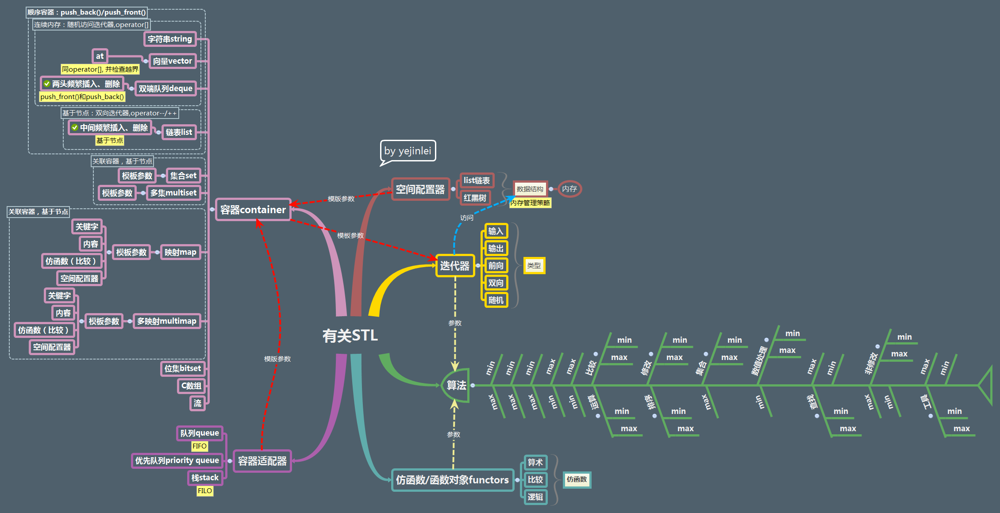

About系列
=====

* 有关语言
  * 有关C++系列
     * [有关STL](有关语言/有关C++系列/有关STL.xmind)，如图：

     
     
     * [有关Boost](有关语言/有关C++系列/有关Boost.xmind)，如图：

     
     
 * 有关R语言系列
 	* [有关ggplot2](有关语言/有关R语言系列/有关ggplot2.xmind)，如图：

 	

