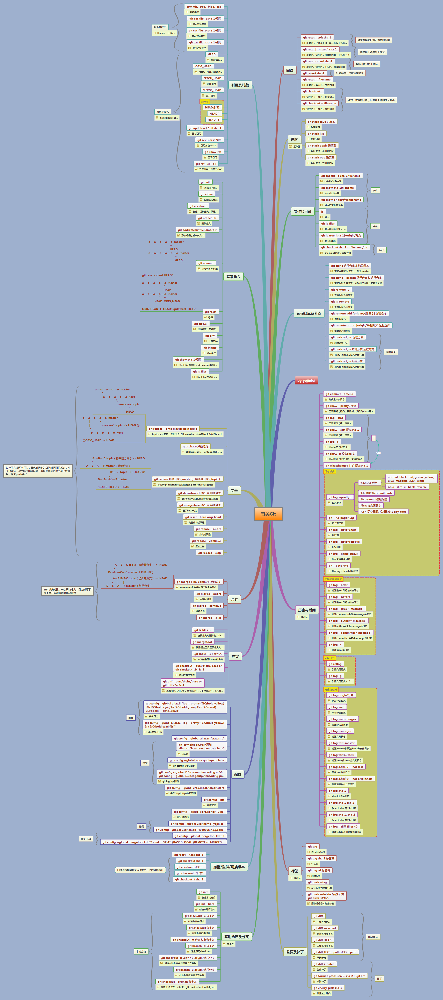
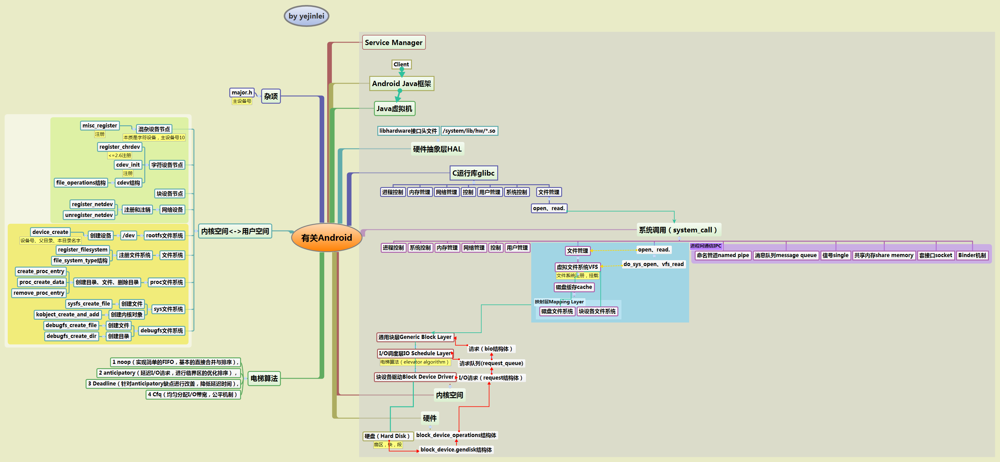

About系列
=====

* 有关语言
  * 有关C++系列
     * [有关STL](有关语言/有关C++系列/有关STL.xmind)，如图：

     
     
     * [有关Boost](有关语言/有关C++系列/有关Boost.xmind)，如图：

     
     
   * 有关Java系列
   	 * [有关Maven](有关语言/有关Java系列/有关Maven.xmind)，如图：

     
     
 * 有关R语言系列
 	* [有关ggplot2](有关语言/有关R语言系列/有关ggplot2.xmind)，如图：

 	

 * 有关工具
 	* [有关GDB](有关工具/有关GDB.xmind)，如图：

 	
 	
 	* [有关Vim.xmind](有关工具/有关Vim.xmind)，如图：

 	
 	
 	* [有关WinDbg.xmind](有关工具/有关WinDbg.xmind)，如图：

 	
 	

* [有关正则表达式](有关正则表达式.xmind)，如图：

	
	
 
* 有关版本控制
 	* [有关git](有关工具/有关git/有关Git.xmind)，如图：

 	
 	
 	
* 有关安全与防范
 	* [有关安全和密码学](有关安全与防范/有关安全和密码学.xmind)，如图：

 	
 	
 	
* 有关操作系统
 	* [有关Android](有关操作系统/有关Android.xmind)，如图：

 	
 	
 	* [有关Makefile](有关操作系统/有关Makefile.xmind)，如图：

 	
 	
 	
* 有关数学
 	* [有关数学体系](有关数学/有关数学体系.xmind)，如图：

 	
 