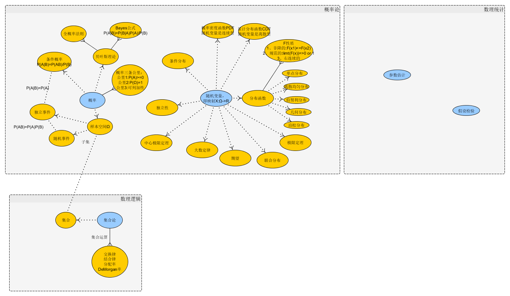

#有关数学笔记

* [随机数学](#随机数学)

	* [概率论](#概率论)
	
* [近代数学](#近代数学)

	* [集合论](#集合论)
 
<h2 id="随机数学">随机数学</h2>
<h3 id="概率论">概率论</h3>
  `概率是定义在某些试验结果的集合上的`

- 概率模型

	- 样本空间Ω（基本空间），一个试验的所有可能结果的集合
	
	- 概率律，概率律为试验结果的集合A（随机事件，简称事件）确定一个非负数P(A)（事件A的概率），而这个数刻画了我们对事件A的认识或所产生的信念的程度

	

- 样本空间和事件
- 概率律公理
	- 非负数
	- 归一化
	- 可加性

<h2 id="近代数学">近代数学</h2>
<h3 id="集合论">集合论</h3>