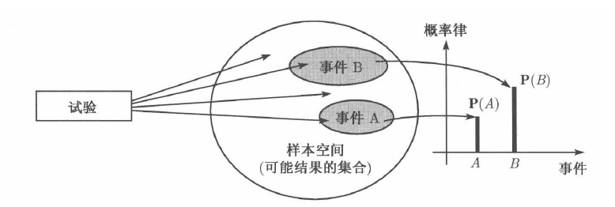

#有关数学笔记

* [随机数学](#随机数学)
	* [概率论](#概率论)
* [近代数学](#近代数学)
	* [数理逻辑](#数理逻辑)
		* [集合论](#集合论)
	* [组合数学](#组合数学)
		* [排列与组合](#排列与组合)
	* [图论](#图论)
* [经典数学](#经典数学)
	* [微积分](#微积分)
* [计算机数学](#计算机数学)

 
<h2 id="随机数学">随机数学</h2>
<h3 id="概率论">概率论</h3>
  `概率是定义在某些试验结果的集合上的`

- 概率模型

	- 样本空间Ω（基本空间），一个试验的所有可能结果的集合
	
	- 概率律，概率律为试验结果的集合A（随机事件，简称事件）确定一个非负数P(A)（事件A的概率），而这个数刻画了我们对事件A的认识或所产生的信念的程度

	

- 样本空间和事件
- 概率律公理
	- 非负数
	- 归一化
	- 可加性

<h2 id="近代数学">近代数学</h2>
<h3 id="数理逻辑">数理逻辑</h3>
<h4 id="集合论">集合论</h4>
<h3 id="组合数学">组合数学</h3>
<h4 id="排列与组合">排列与组合</h4>
<h3 id="图论">图论</h3>

<h2 id="经典数学">经典数学</h2>
<h3 id="微积分">微积分</h3>
- 函数
	
		1. 函数是数学语言描述现实世界的关键成分；函数可以用方程式、数值表、图形或者文字描述		
		2. 函数是讲一个对象转化为另外一个对象的规则，起始对象称为输入，来自称为定义域的集合，返回的对象称为输出，来自称为上域的集合
		3. y=f(x)，读作y等于f对x的值

	- 函数类型
		- 线性函数
		- 幂函数
		- 多项式
		- 代数函数，对多项式进行代数运算（加减乘除取根）构成的函数，有理函数是代数函数的特例
		- 超越函数（非代数函数的一类函数）
			- 三角函数
				- 正弦
				- 余弦
				- 正切
				- 余切
				- 正割
				- 余割
				- 余弦定理
			- 反三角函数
			- 指数函数
				- 指数法则
				- 自然指数函数e^x
			- 对数函数
				- 自然对数函数lnx及代数性质
	- 函数性质
		- 增函数与减函数
		- 奇函数与偶函数：函数的对称性
	- 函数变形
		- 函数的加、减、乘、除
		- 复合函数
		- 函数的移动：水平移动和垂直移动
		- 函数的拉长和压缩 
- 极限与连续性
	- 函数极限
		- 两个重要的极限
			- lim(sinx/x) = 1, x->0
			- lim((1+1/x)^x) = e, x->无穷大 
	- 极限法则（计算函数算术组合的极限）
		- 和法则
		- 差法则
		- 积法则
		- 商法则
		- 常数倍法则
		- 幂法则
	- 夹层定理
	- 单侧极限和双侧极限
	- 连续性
		- 连续性检验法（一点）：
			1. f(c)存在（c在f的定义域内）
			2. 极限存在：lim(f(x))存在，x->c
			3. 极限等于函数值：lim(f(x))=f(c),x->c
		- 连续函数：一个函数在区间上是连续的，当且仅当它在区间上`每个点`是连续的
		- 最大值和最小值定理：在闭区间上的连续函数f(x)一定是有上下界的
		- 介值定理：说在闭区间上的`连续函数`f(x)，如果左右端点的取值不同，例如
，那么区间中肯定有一点的函数值能够取到 之间的任何一个值
		- 零点定理：说在闭区间上的`连续函数`f(x)，如果左右端点的取值异号，例如
，那么区间中肯定有一点的函数值为0

- 微分
	- 导数
		
			导数的几何意义就是曲线在某点的切线的斜率，反应了变化的快慢。
	
	- 如何求导
		- 基础初等函数的导数
		- 复合函数的求导法则
		- 反函数的求导
		- 函数的和、差、积、商的求导法则
	- 几阶导数
		- 一阶导数
		- 二阶导数
		- 高阶导数
	- 链式法则
	- 参数方程
	- 隐式微分法
	- 导数的应用
		- 函数的极值
		- 中值定理
		- 单调函数
		- 凹性
		- 最优化
		- 不定式与洛必达法则
		- 牛顿法
		- 反导数
- 积分
	- 不定积分
	- 定积分
	- 数值积分
- 泰勒展开
- 拉普拉斯变换
- 留数
- 微分方程
	- 一阶常微分方程
	- 二阶常微分方程
	- 一阶线性微分方程组

<h2 id="计算机数学">计算机数学</h2>