#有关GCC

##GCC源码编译

##GCC参数选项
	-D，定义命令宏
		//-DDEBUG相当于#define DEBUG
		#ifdef DEBUG
			printf("this code is for debugging\n");
		#endif

	-S，输出汇编文件
	-std，指定标准，例如-std=c99
	-O，指定优化级别，例如-O2,-Os
	-l，链接静态库，例如myprintf.a静态库，-lmyprintf
	-L, 指定库搜索路径
	-static, 静态库和共享库同名时，优先使用静态库

##词法分析

##语法分析

##语义分析

##中间IR

##优化

##汇编器

##连接器
###单个.o文件
###多个.o文件
###静态库链接
###共享库链接

##ELF
###ELF类型
	readelf -h 目标文件 | grep Type
	relocatable（可重定位）：.o文件、.a文件
	executable（可执行）：
	shared libarary（共享库）：.so文件
	
###ELF文件的链接视图和执行视图

###节区头部数据结构
	typedef struct{
		Elf32_Word sh_name;		//节区名,  .开头节区名称通常为系统保留
		Elf32_Word sh_type;		//节区类型，↓
									1、SHT_NULL，取值0，非活动没有节区，节区头部其他成员无意义
									2、SHT_PROGBITS，取值1，目标文件自定义区，由程序解释
									3、SHT_SYMTAB，取值2，该节区包含一个符号表，目标文件只能包含一个
									4、SHT_STRTAB，取值3，该节区包含一个字符串表，目标文件可以包含多个
									5、SHT_RELA，取值4，该节区包含重定位表项,可能会有补齐，目标文件可以包含多个
									6、SHT_HASH，取值5，该节区包含一个符号hash表，与动态链接有关，目标文件只能包含一个
									7、SHT_DYNAMIC，取值6，该节区包含动态链接的信息，目标文件只能包含一个
									8、SHT_NOTE，取值7，该节区包含文件的信息
									9、SHT_NOBITS，取值8，不占用目标文件空间
									10、SHT_REL，取值9，该节区包含重定位表项,不补齐，目标文件可以包含多个
									11、SHT_SHLIB，取值10，语义未规定
									12、SHT_DYNSYM，取值11，最小的符号集合，节省空间
							
		Elf32_Word sh_flags;	//节区属性，↓
									1、SHF_WRITE，取值0x1，可写属性
									2、SHF_ALLOC，取值0x2，占用内存
									3、SHF_EXECINSTR，取值0x4，可执行
									4、SHF_MASKPROC，取值0xF0000000，专用
		Elf32_Addr sh_addr;
		Elf32_Off sh_offset;
		Elf32_Word sh_size;
		Elf32_Word sh_link;
		Elf32_Word sh_info;
		Elf32_Word sh_addralign;
		Elf32_Word sh_entsize;
	}Elf32_Shdr;

###特殊节区
名称 			|类型 				|属性 			|含义
----------------|----------------|----------------|----------------
.bss            |                |                |   
.shstrtab       |SHT_STRTAB		 |				  |	包含节区名称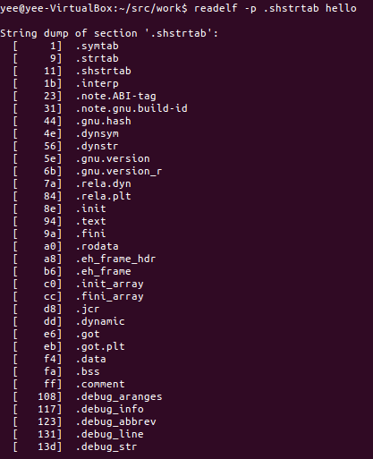
.initerp        |SHT_PROGBITS	 |				  |	目标文件运行时，用于搜索依赖的glibc共享库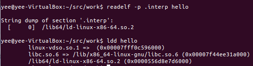
.comment        |SHT_PROGBITS	 |				  |	OS和GCC版本信息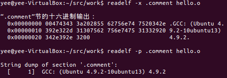
.note.abi.tag   |SHT_NOTE	     |				  |	readelf -n obj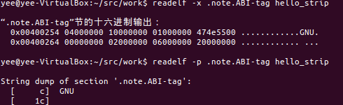
.note.gnu.build-id|SHT_NOTE	     |				  |	readelf -n obj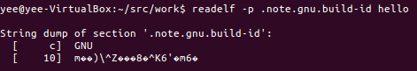
.rela.[name]    |SHT_RELA	     |				  |	readelf -r obj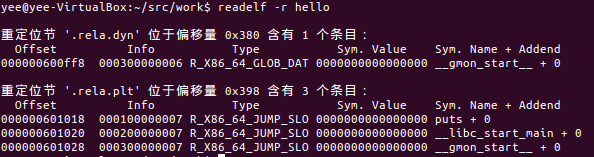
.dynsym         |SHT_DYNSYM	     |				  |	包含动态链接符号表，readelf --dyn-syms/-s obj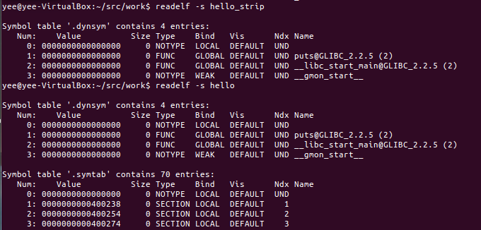
.symtab			|SHT_SYMTAB	     |				  |	包含一个符号表，readelf -s obj，strip会删除该区

###实验
####readelf -all(strip处理后、没有-g选项，-g选项)
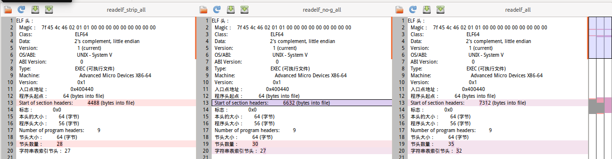

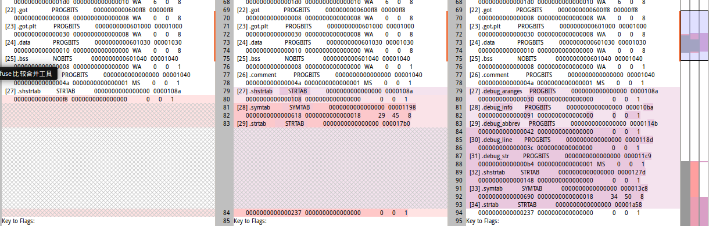

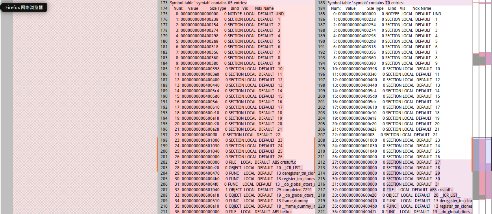

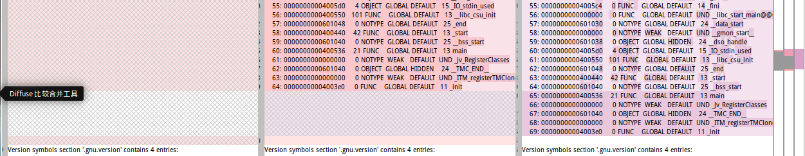

####gcc选项，对目标文件节区的影响

##参考资料
