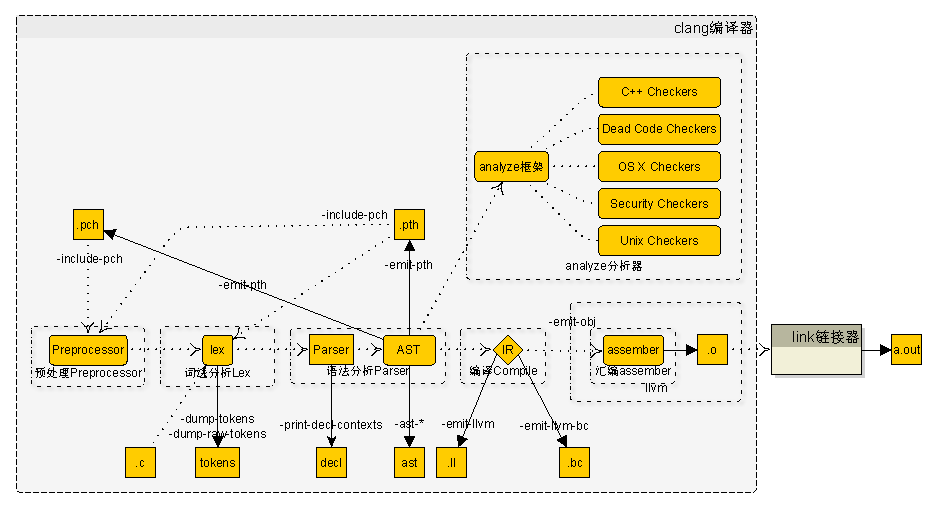
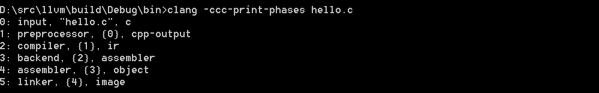
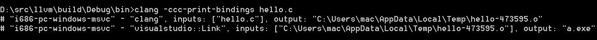
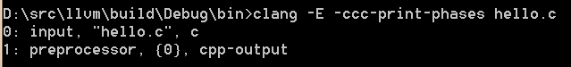
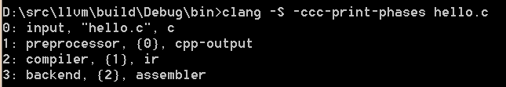
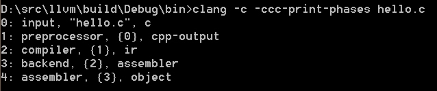
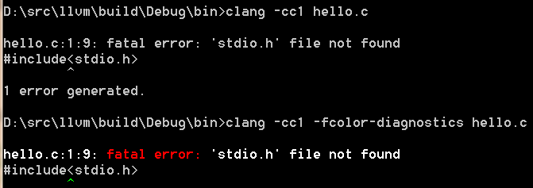
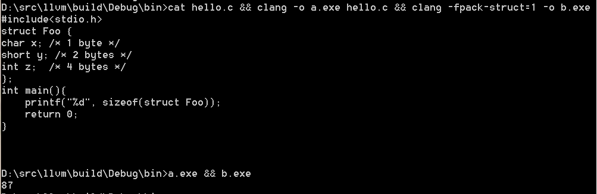
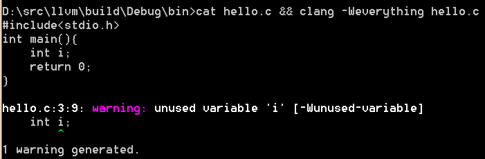

#有关LLVM

##一、编译与安装
###1、Linux下源码编译

	$ git clone [http://llvm.org/git/llvm.git](http://llvm.org/git/llvm.git)
	$ cd llvm/tools
	$ git clone [http://llvm.org/git/clang.git](http://llvm.org/git/clang.git)
	$ cd clang/tools
	$ git clone [http://llvm.org/git/clang-tools-extra.git](http://llvm.org/git/clang-tools-extra.git) extra
	$ cd ../../llvm/projects
	$ git clone [http://llvm.org/git/compiler-rt.git](http://llvm.org/git/compiler-rt.git)
	$ git clone [http://llvm.org/git/llvm-project/test-suite.git](http://llvm.org/git/llvm-project/test-suite.git)   #测试套，可选
	$ cd ../llvm/tools
	$ git clone http://llvm.org/git/llvm-project/lldb.git #低级别调试器，可选
	$ mkdir where-you-want-to-install	#安装目录
	$ mkdir where-you-want-to-build		#编译目录
	$ cd where-you-want-to-build
	$ /PATH_TO_SOURCE/configure --disable-optimized --prefix=../where-youwant-to-install  #--enable-optimized(off),--enable-assertions(on),--enable-shared(off),--enable-jit(on),--enable-targets(all)
	$ make && make install				#开始编译
	$ echo $?    #返回0.表明编译成功
	$ export PATH="$PATH:where-you-want-to-install/bin"		#加到PATH环境变量中
	$ clang –v

###2、Windows下源码编译
	下载源码，同上
	下载[cmake-3.3.1-win32-x86.exe](http://www.cmake.org/files/v3.3/cmake-3.3.1-win32-x86.exe)，安装cmake
	打开cmake GUI， ADD Entry。 CMAKE_INSTALL_PREFIX等同于--prefix；LLVM_TARGETS_TO_BUILD("ARM;Mips;X86")等同于--enable-targets

###3、Mac OS X下源码编译
	比windows,cmake多一个变量LLVM_ENABLE_PIC

##二、Clang
	clang分三个实体概念：
		clang驱动：利用现有OS、编译环境以及参数选项来驱动整个编译过程的工具。
		clang编译器：利用clang前端组件及库打造的编译器，其入口为cc1_main; 参数为clang -cc1 或者 -Xclang；
        clang前端组件及库：包括Support、Basic、Diagnostics、Preprocessor、Lexer、Sema、CodeGen等；

###1、clang前端组件及库，参考["Clang" CFE Internals Manual](http://clang.llvm.org/docs/InternalsManual.html#basic-blocks)

- **LLVM Support Library**

		提供基本的库和数据结构，包括命令行选项处理、各种容器、系统抽象层和文件系统操作

- **The Clang “Basic” Library**
	
		这个“基本”库包含了跟踪和操作代码缓存，源码缓存区中的定位，诊断，序列，目标抽取，和被编译的编程语言的子集的相关信息这
        一系列的底层公共操作。这个库的一部分是特别针对C语言的（比如TargetInfo类），剩下的部分可以被其他的不是基于C的编程语
		言重用（SourceLocation, SourceManager, Diagnostics, FileManager）。

- **诊断字系统（Diagnostics）**

		DiagnosticParseKinds.td

	- **Diagnostic、DiagnosticConsumer类**
		- SourceLocation、SourceManager类
		- SourceManager类用于加载和缓存源代码
- **The Driver Library**
- **Precompiled Headers**
- **The Frontend Library**
- **The Lexer and Preprocessor Library**
	
		token分为：
			1、正常token 
			2、注解token

	- Preprocessor类
	- Token类
	- TokenLexer类
	- Lexer类
	- MultipleIncludeOpt类
	- The Parser Library
		- parser类
	- The AST Library
		- Type类及其子类
		- ASTContext类
		- QualType类
		- DeclarationName类
		- DeclContext类
		- CFG类
		
					源码级控制流图，专用于语句(Stmt\*),通常用于函数体CompoundStmt，通过查找“: public Stmt”可以找到所有
					的子类语句

			- 基本块 
			
					是一个只能从它的第一条指令进入，并从最后一条指令离开的最长的指令序列。
					基本块第一条指令（首领leader）：1、程序的入口点 2、分支的目标 3、分支下条指令

				- CFGBlock
			- 入口(entry)和出口节点(exit)
				- null
			- 条件控制流
				- null   
- **The Sema Library**

		该库被Parser库调用用于作语义分析，输出AST

- **The CodeGen Library**

		输入AST输出LLVM IR

###2、clang编译器
####21、编译器选项（clang -cc1 -help，CC1Options.td中定义）	
选项  | 说明 | Action子类 | Consumer子类 | 备注
------------- | ------------- | ------------- | ------------- | -------------
-ast-list | 打印ast节点 | ASTDeclListAction | ASTDeclNodeLister | clang -S -D_WIN32 -Xclang **-ast-list** hello.c
-ast-dump | 打印ast详细信息 | ASTDumpAction | ASTPrinter | 
-emit-llvm | 生成.ll IR汇编文件 | EmitLLVMAction | BackendConsumer | clang -S -D_WIN32 -Xclang **-emit-llvm** hello.c -o hello.ll
-emit-llvm-bc | 生成.bc IR二进制文件 | EmitBCAction | BackendConsumer | clang -S -D_WIN32 -Xclang **-emit-llvm-bc** hello.c -o hello.bc

####22、架构图

irst Header  | Second Header
------------- | -------------
Content Cell  | Content Cell
Content Cell  | Content Cell

####24、预处理
	一、常见的预处理有：文件包含，条件编译、布局控制和宏替换4种：
 	1、文件包含，例如：#include
	2、条件编译，例如：#if,#ifndef,#ifdef,#endif,#undef等
	3、布局控制，例如：#progma
	4、宏替换，例如：#define
	
	二、预编译

	三、Preprocessor类，包含
		DiagnosticsEngine诊断引擎
		LangOptions编译选项
		TargetInfo存储目标信息
		FileManager文件管理器
		SourceManager源码管理器
		ModuleLoader module加载器

####25、词法分析
	一、Token类型
		- CXToken_Punctuation，标点符号
		- CXToken_Keyword，关键字或保留字
		- CXToken_Identifier，标识符
		- CXToken_Literal，数字、字符、字符串
		- CXToken_Comment，注释

	二、TokenKinds.def，关键字定义	 

	三、class列表
		- PreprocessorLexer
		- Lexer
			- ::ExtendedTokenMode,根据它的值的不同：0、1、2，分别对应只返回正常的token，返回comments和正常的token，返回空格、comments和正常的token
####26、语法分析
####27、编译

####28、流程分析
- 入口cc1_main

	> 创建编译器对象Clang（CompilerInstance）
	>
	> 解析选项Clang->CreateFromArgs
	- 解析静态分析相关参数选项ParseAnalyzerArgs，例如-analyze
	- ParseFrontendArgs
	- ...
	> 创建诊断对象Clang->createDiagnostics()
	> 
	> 执行前端action，ExecuteCompilerInvocation↓
    
	- 创建action，CreateFrontendAction
		- 调用CreateFrontendBaseAction
			- **编译宏CLANG_ENABLE_STATIC_ANALYZER，同时参数为RunAnalysis: 创建静态分析Action（AnalysisAction）并返回**
	- 执行action，Clang->ExecuteAction，传入ACT（AnalysisAction）
		> Act.BeginSourceFile（FrontendAction::BeginSourceFile）
		- 创建具体的Consumer并插入到Consumers（AnalysisConsumer只是其中之一），CI.setASTConsumer(CreateWrappedASTConsumer(CI, InputFile));
		- 创建ASTConsumer对象

		> action真正执行，Act.Execute()
		- 调用ExecuteAction
			- 编译器对象创建源代码Consumer，通过createCodeCompletionConsumer函数
			- 编译器对象使用源代码Consumer，来创建语义对象（Sema）
			- ParseAST
				- 语法分析（词法分析）ParseTopLevelDecl
				- HandleTopLevelDecl（由具体ASTConsumer子类对象决定，如果是CodeGenerator就生成二进制文件）
		 
		> Act.EndSourceFile（FrontendAction::EndSourceFile）
		- 如果DisableFree为1，保留Sema、ASTContext、ASTConsumer
		- 否则，重置Sema、ASTContext、ASTConsumer为nullptr

- 词法分析

- 语法分析
	- ParseTopLevelDecl
		- ParseExternalDeclaration
		    - ParseDeclaration
		    	- 获取token类型
			    	- **case 模板、导出：**
			    		- ParseDeclarationStartingWithTemplate
			    	- **case 内联：**
			    		- ParseSimpleDeclaration
			    	- **case 名字空间：**
			    		- ParseNamespace
			    	- **case using：**
			    		- ParseUsingDirectiveOrDeclaration
			    	- **case assert：**
			    		- ParseStaticAssertDeclaration
					- **case 其他：**
			    		- ParseSimpleDeclaration
				- ConvertDeclToDeclGroup			    		
		    		
			- **case 未知：** ParseDeclarationOrFunctionDefinition
				- ParseDeclOrFunctionDefInternal
					- ParseDeclGroup			
						- ActOnDeclarator
							- HandleDeclarator
								- or ActOnTypedefDeclarator
								- or ActOnFunctionDeclarator
								- or ActOnVariableDeclarator
						- **函数定义**ParseFunctionDefinition
							- ParseFunctionDefinition
								- ParseCompoundStatementBody
									- ParseStatementOrDeclaration
										- ParseStatementOrDeclarationAfterAttributes
											- **case if语句**
												- ParseIfStatement
											- **case 其他语句**
												- Pasese_XX_Statement
												
- **代码生成，**HandleTopLevelDecl

####29、静态分析Clang Static Analyzer

###3、clang驱动
####31、 驱动选项（clang -help，Options.td定义）
- -cc1，clang编译器

- -###，打印clang driver Parse阶段命令行参数，参考：[Driver Design & Internals](http://clang.llvm.org/docs/DriverInternals.html)

- -ccc-print-phases，打印clang driver Pipeline阶段信息

- -ccc-print-bindings，打印clang driver Bind阶段各工具链及输入输出文件

- -Ｅ，预处理

- -Ｓ，预处理～汇编

- -c，预处理～生成obj

- -fcolor-diagnostics，诊断色彩

- -driver-mode=cl，等同于clang-cl，兼容VC

- emit-llvm，生成.ll中间语言文件

- -fsanitize=address

- -Wpadded

- -fpack-struct=1 or n，压缩

- -Wunused-variable，未初始化

####32、架构图
####33、流程分析
	1、解析参数选项
	2.1、如果有-cc1，走clang编译器流程
	2.2、创建Driver对象，传入Triple（编译clang时已指定）
	3、llvm初始化平台
	4、获取环境变量，如CC_PRINT_OPTIONS
	5、Driver.BuildCompilation，返回编译器对象
		⑴ 根据Triple，创建工具链对象，例如toolchains::Windows★
		⑵ 创建编译器对象C（Compilation）
		Driver.BuildActions构建JobAction
			⑶ getFinalPhase，根据参数选项，获取编译最终阶段FinaPhases
			⑷ getCompilationPhases，分析所需的阶段放入PL中
			for_each遍历PL
				⑸ ConstructPhaseAction，根据不同阶段创建不同的JobAction并放入Actions,例如预处理阶段，创建PreprocessJobAction; phases::Link不在这里处理
				
			⑹ 如果LinkerInputs不为空，按需创建LinkJobAction放入Actions
		Driver.BuildJobs构建任务
			⑺ BuildJobsForAction
				BuildJobsForAction
					TC->SelectTool
					√ clang::Constructjob，创建clang编译器的大量参数选项★
					√ visualstudio::Link::Constructjob，Link的参数选项★
			
	6、Driver.ExecuteCompilation，编译器对象执行任务
		Compilation::ExecuteJob
			ExecuteCommand★
				创建子进程执行命令，例如clang -cc1 xxxx; link.exe xxxx★
	7、Driver.generateCompilationDiagnostics,产生诊断信息
	8、llvm::llvm_shutdown()
        
####33、其他
- 多语言前端（multiple language front-ends）
- 语言级别静态优化（Static Optimizer）
- 虚拟指令集（virtual instruction set）
	- 虚拟寄存器Static Single Assignment（SSA）
- 抽象语法树（AST）
- 用例
- extras工具
	- Clang Check：语法检查，输出AST
	- Clang Format: 代码格式化
	- Clang Modernizer: C++11风格
	- Clang Tidy: Google代码风格检查
	- Modularize: 模块化
	- PPTrace: C++预编译跟踪 

- 流程分析

									
##三、LLVM
###PASS内容
####内置pass
	CodegenAction::Execuetion
		clang::ParseAST
	BackendConsumer::HandleTranslationUnit
		clang::EmitBackendOutput
			EmitAssemblyHelper::EmitAssembly,根据参数选项添加不同的pass
				case Backend_EmitNothing： 不创建，对应-emit-llvm-only
				case Backend_EmitBC： 创建WriteBitcodePass，对应选项-emit-llvm-bc
				case Backend_EmitLL:  创建PrintModulePassWrapper，对应-emit-llvm
				case 其他：			创建TargetLibraryInfoWrapperPass，FunctionPass，对应-emit-obj、-emit-codegen-only

####pass相关类
	PassManagerBuilderWrapper
####编写一个pass

- bytecode
- Three-address code
	- 算术操作arithmetic
	- 逻辑操作logical
- Run-time optimization
- Just-In-Time (JIT)
- Multi-stage Optimization
- native code

- Run Time
   - Profile
   		- 热点函数（hot functions）
   		- 循环（loops）
   		- 关键路径（hot paths）
   - Reoptimization
   		- offline reoptimizer

- examples例子
	- BrainF
	- ExceptionDemo
	- Fibonacci
	- HowToUseJIT
	- ModuleMaker
	- Kaleidoscope，展示了如何在LLVM之上构建一个支持一门自己定义的编程语言的编译器
	- OCaml-Kaleidoscope
	- ParallelJIT