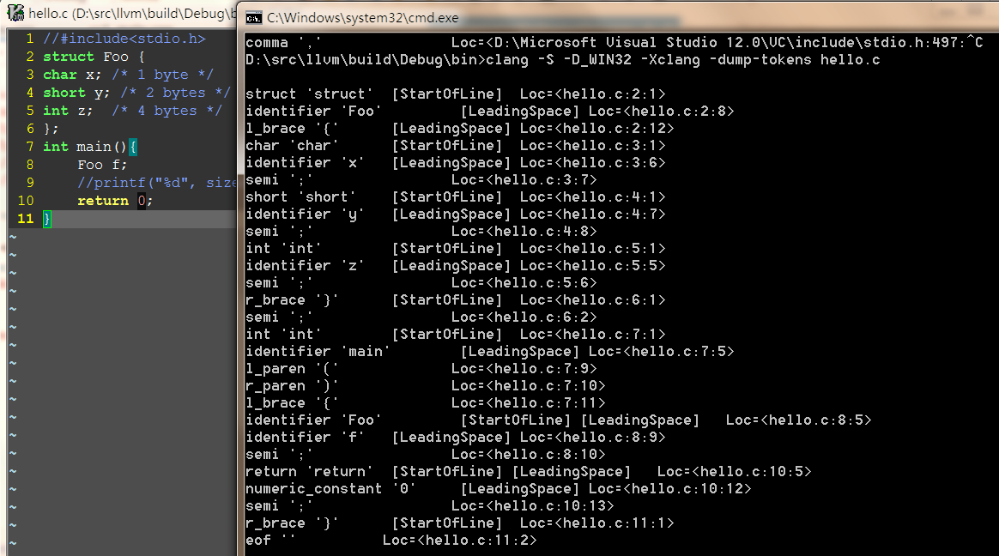
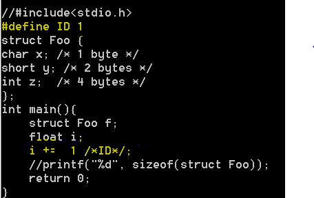
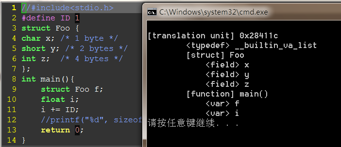
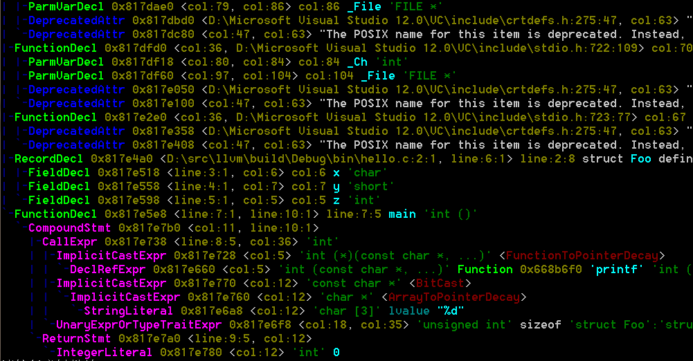
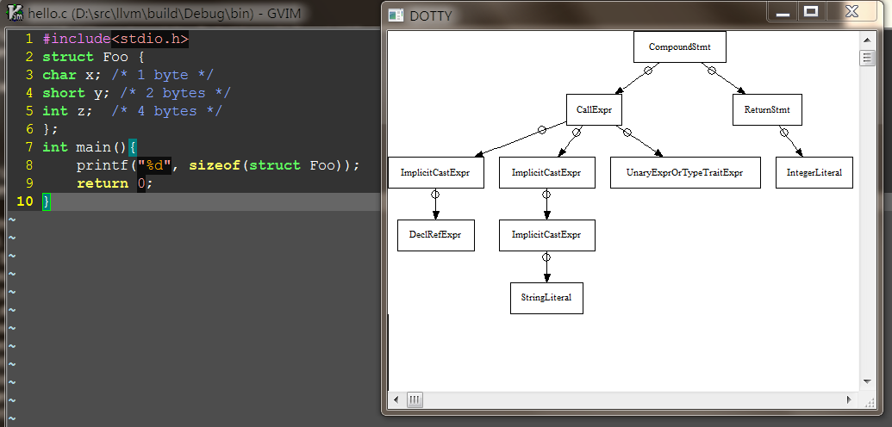
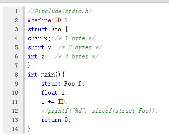
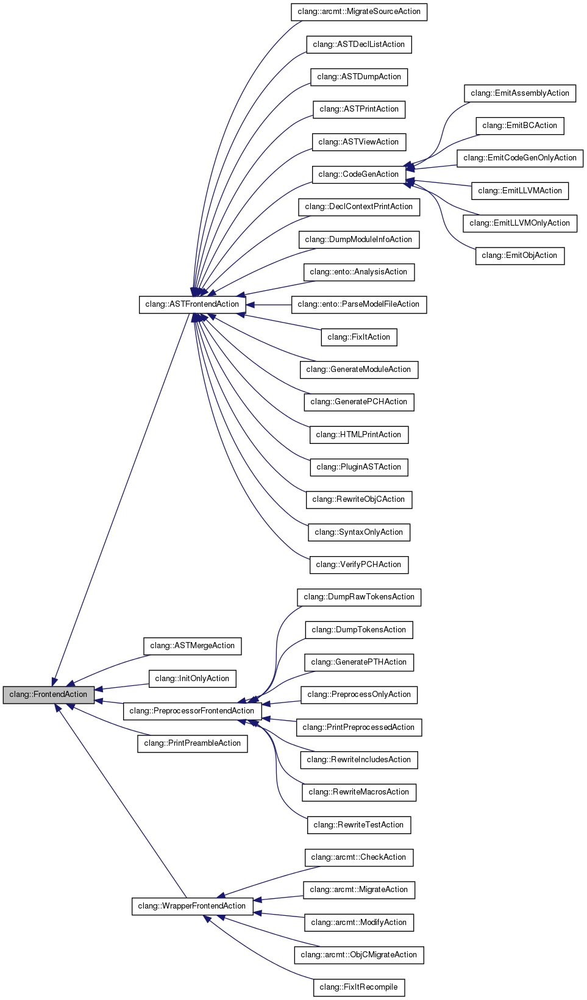
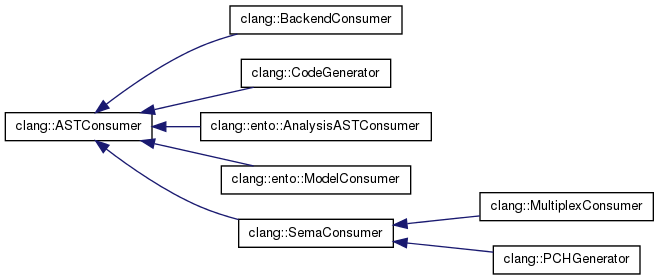

#有关LLVM

##一、编译与安装
###1、Linux下源码编译

	$ git clone [http://llvm.org/git/llvm.git](http://llvm.org/git/llvm.git)
	$ cd llvm/tools
	$ git clone [http://llvm.org/git/clang.git](http://llvm.org/git/clang.git)
	$ cd clang/tools
	$ git clone [http://llvm.org/git/clang-tools-extra.git](http://llvm.org/git/clang-tools-extra.git) extra
	$ cd ../../llvm/projects
	$ git clone [http://llvm.org/git/compiler-rt.git](http://llvm.org/git/compiler-rt.git)
	$ git clone [http://llvm.org/git/llvm-project/test-suite.git](http://llvm.org/git/llvm-project/test-suite.git)   #测试套，可选
	$ cd ../llvm/tools
	$ git clone http://llvm.org/git/llvm-project/lldb.git #低级别调试器，可选
	$ mkdir where-you-want-to-install	#安装目录
	$ mkdir where-you-want-to-build		#编译目录
	$ cd where-you-want-to-build
	$ /PATH_TO_SOURCE/configure --disable-optimized --prefix=../where-youwant-to-install  #--enable-optimized(off),--enable-assertions(on),--enable-shared(off),--enable-jit(on),--enable-targets(all)
	$ make && make install				#开始编译
	$ echo $?    #返回0.表明编译成功
	$ export PATH="$PATH:where-you-want-to-install/bin"		#加到PATH环境变量中
	$ clang –v

###2、Windows下源码编译
	下载源码，同上
	下载[cmake-3.3.1-win32-x86.exe](http://www.cmake.org/files/v3.3/cmake-3.3.1-win32-x86.exe)，安装cmake
	打开cmake GUI， ADD Entry。 CMAKE_INSTALL_PREFIX等同于--prefix；LLVM_TARGETS_TO_BUILD("ARM;Mips;X86")等同于--enable-targets

###3、Mac OS X下源码编译
	比windows,cmake多一个变量LLVM_ENABLE_PIC

##二、Clang
	clang分三个实体概念：
		clang驱动：利用现有OS、编译环境以及参数选项来驱动整个编译过程的工具。
		clang编译器：利用clang前端组件及库打造的编译器，其入口为cc1_main; 参数为clang -cc1 或者 -Xclang；
        clang前端组件及库：包括Support、Basic、Diagnostics、Preprocessor、Lexer、Sema、CodeGen等；

###1、clang前端组件及库，参考["Clang" CFE Internals Manual](http://clang.llvm.org/docs/InternalsManual.html#basic-blocks)

- **LLVM Support Library**

		提供基本的库和数据结构，包括命令行选项处理、各种容器、系统抽象层和文件系统操作

- **The Clang “Basic” Library**
	
		这个“基本”库包含了跟踪和操作代码缓存，源码缓存区中的定位，诊断，序列，目标抽取，和被编译的编程语言的子集的相关信息这
        一系列的底层公共操作。这个库的一部分是特别针对C语言的（比如TargetInfo类），剩下的部分可以被其他的不是基于C的编程语
		言重用（SourceLocation, SourceManager, Diagnostics, FileManager）。

- **诊断字系统（Diagnostics）**

		DiagnosticParseKinds.td

	- **Diagnostic、DiagnosticConsumer类**
		- SourceLocation、SourceManager类
		- SourceManager类用于加载和缓存源代码
- **The Driver Library**
- **Precompiled Headers**
- **The Frontend Library**
- **The Lexer and Preprocessor Library**
	
	- token分为：
		- 1、正常token 
		- 2、注解token
	- Preprocessor类
		- 成员变量
			- LexingRawMode： 原始模式，输出空格、注释等token 
	- Token类
	- TokenLexer类
	- Lexer类
	- MultipleIncludeOpt类
	- The Parser Library
		- parser类
	- The AST Library
		- Type类及其子类
		- ASTContext类
		- QualType类
		- DeclarationName类
		- DeclContext类
		- CFG类
		
					源码级控制流图，专用于语句(Stmt\*),通常用于函数体CompoundStmt，通过查找“: public Stmt”可以找到所有
					的子类语句

			- 基本块 
			
					是一个只能从它的第一条指令进入，并从最后一条指令离开的最长的指令序列。
					基本块第一条指令（首领leader）：1、程序的入口点 2、分支的目标 3、分支下条指令

				- CFGBlock
			- 入口(entry)和出口节点(exit)
				- null
			- 条件控制流
				- null   
- **The Sema Library**

		该库被Parser库调用用于作语义分析，输出AST

- **The CodeGen Library**

		输入AST输出LLVM IR

###clang编译器
####编译器选项（clang -cc1 -help，CC1Options.td中定义）	
   选项     | 说明 | FrontendAction子类 | ASTConsumer子类 | 备注
------------- | ------------- | ------------- | ------------- | -------------
-init-only | | InitOnlyAction | | 只做前端初始化
-Eonly | | PreprocessOnlyAction | | 只做预处理，不输出
-dump-tokens | 打印token | DumpTokensAction |  | 与-Eonly类似，但输出tokens
-dump-raw-tokens | 打印token | DumpRawTokensAction |  | 与-Eonly类似，但输出原始tokens，包括空格符
-rewrite-test | 测试宏定义处理 | RewriteTestAction |  | 类似-rewrite-macros，仅测试用
-rewrite-macros | 处理并扩展宏定义 | RewriteMacrosAction |  | 
-print-decl-contexts | 打印声明 | DeclContextPrintAction | DeclContextPrinter | 
-ast-list | 打印ast节点 | ASTDeclListAction | ASTDeclNodeLister | clang -S -D_WIN32 -Xclang **-ast-list** hello.c
-ast-dump | 打印ast详细信息 | ASTDumpAction | ASTPrinter | 
-ast-view | 生成ast dot | ASTViewAction | ASTViewer | 
-emit-html | 生成高亮的代码网页 | HTMLPrintAction | HTMLPrinter | 
-analyze | 运行静态分析引擎 | AnalysisAction | AnalysisConsumer | 后续重点介绍
-emit-llvm | 生成.ll IR汇编文件 | EmitLLVMAction | BackendConsumer | clang -S -D_WIN32 -Xclang **-emit-llvm** hello.c -o hello.ll
-emit-llvm-bc | 生成.bc IR二进制文件 | EmitBCAction | BackendConsumer | clang -S -D_WIN32 -Xclang **-emit-llvm-bc** hello.c -o hello.bc
-migrate | 代码迁移 | MigrateSourceAction | ObjCMigrateASTConsumer | 

*备注：*

1. FrontendAction及其子类主要是前端功能的集合，不同的子类包含的功能不同；
2. ASTConsumer及其子类主要是后端功能的集合，不同的子类包含的功能不同；
3. 编译器选项表格中基本上按功能从小到大排列；

####clang流程分析
- 入口cc1_main

	> 创建编译器对象Clang（CompilerInstance类）
	>
	> CompilerInvocation::CreateFromArgs
	- 从clang/Driver/Options.inc读取选项，构建选项表
	- **ParseFrontendArgs解析出前端选项**，例如选项-analyze，对应frontend::RunAnalysis；-plugin，对应frontend::PluginActionfrontend::PluginAction；
	- ParseAnalyzerArgs解析出静态分析analyze有关的参数与子选项，例如-analyzer-checker
	> 创建诊断引擎对象（DiagnosticsEngine类）， CompilerInstance::createDiagnostics
	> 
	> ExecuteCompilerInvocation↓
    
	- **创建FrontendAction子类对象，CreateFrontendAction工厂模式**
		- 调用CreateFrontendBaseAction，根据FrontendAction相关类型，创建FrontendAction子类对象
			- 如果frontend::RunAnalysis，创建AnalysisAction类对象
			- 其他类型创建其他FrontendAction子类对象
			- 如果选项为frontend::PluginAction（选项-plugin），创建PluginASTAction类对象
	- CompilerInstance::ExecuteAction，传入ACT（AnalysisAction类）
		> FrontendAction::BeginSourceFile，创建具体的Consumer并插入到Consumers
		- **CreateWrappedASTConsumer，集中创建Consumer子类对象**
			- **调用FrontendAction子类对象的CreateASTConsumer函数，创建Consumer子类对象，因此每个FrontendAction子类必须重写该函数**
			- 如果有clang插件(-plugin)，遍历调用所有Consumer子类对象CreateASTConsumer函数，最后创建MultiplexConsumer，封装所有的Consumer子类对象

		> **FrontendAction::Execute()，该函数会调用FrontendAction::ExecuteAction(纯虚函数，每个子类必须实现该函数)**
		- ASTFrontendAction::ExecuteAction()每个FrontendAction子类必须实现自己的函数，下面流程只是个例
			- 如果支持代码补全，则创建代码补全Consumer（PrintingCodeCompleteConsumer类）
			- 创建语义对象Sema，由Preprocessor、ASTConsumer、ASTContextCodeCompleteConsumer等对象传入构成
			- **ParseAST解析抽象语法树**
				- Parser::Initialize
					- Sema::Initialize
						- **ASTConsumer子类::Initialize初始化，例如
							- createCheckerManager
								-  创建checkerMgr对象（CheckerManager类）
								-  创建allCheckers对象（ClangCheckerRegistry类）
									- 构造函数中 
							- AnalysisManager对象
							
				- Parser::ParseTopLevelDecl，语法分析（词法分析）
				- **ASTConsumer子类::HandleTopLevelDecl，每个ASTConsumer子类需要重写**
			- **ASTConsumer子类::HandleTranslationUnit，每个ASTConsumer子类需要重写**
				- 如果是组合ASTConsumer，调用MultiplexConsumer::HandleTranslationUnit，然后遍历调用每个子类HandleTranslationUnit；
				- 如果是静态分析器，调用AnalysisConsumer::HandleTranslationUnit；
				- ... ...
		 
		> Act.EndSourceFile（FrontendAction::EndSourceFile）
		- 如果DisableFree为1，保留Sema、ASTContext、ASTConsumer
		- 否则，重置Sema、ASTContext、ASTConsumer为nullptr

*备注：*

1. 通过clang编译器选项，来选择创建不同的FrontendAction，具体在createFrontendBaseAction函数中，创建不同的FrontendAction对象
2. FrontendAction::CreateASTConsumer用于创建不同ASTConsumer对象，因此需实现该函数；
3. FrontendAction::ExecuteAction用于衔接后端，例如ASTFrontendAction::ExecuteAction调用ParseAST解析语法树并传递给后端，而DumpRawTokensAction只打印tokens；
4. 需要抽象语法树的后端，需要调用ParseAST函数；

####架构图

####预处理Preprocessor
	一、常见的预处理有：文件包含，条件编译、布局控制和宏替换4种：
 	1、文件包含，例如：#include
	2、条件编译，例如：#if,#ifndef,#ifdef,#endif,#undef等
	3、布局控制，例如：#progma
	4、宏替换，例如：#define

	三、Preprocessor类
		成员变量:
			DiagnosticsEngine诊断引擎
			LangOptions编译选项
			TargetInfo存储目标信息
			FileManager文件管理器
			SourceManager源码管理器
			ModuleLoader module加载器
		成员函数:
			Lex,根据CurLexerKind类型调用具体的PreprocessorLexer子类的成员函数Lex去生成Tokens
	

	二、TokenKinds.def，关键字定义	 

####词法分析Lexer
	CXToken类
 		int_data[0]: a CXTokenKind
 		int_data[1]: starting token location
 		int_data[2]: token length
 		int_data[3]: reserved
 		ptr_data: for identifiers and keywords, an IdentifierInfo*. otherwise unused.
	
	CXTokenKind枚举
		CXToken_Punctuation: 标点符号
		CXToken_Keyword: 关键字或保留字
		CXToken_Identifier: 标识符
		CXToken_Literal: 数字、字符、字符串
		CXToken_Comment: 注释

	CurLexerKind枚举
		CLK_Lexer:	
    	CLK_PTHLexer:
    	CLK_TokenLexer: 对应TokenLexer类，用于处理macro宏
    	CLK_CachingLexer:
    	CLK_LexAfterModuleImport:

	PreprocessorLexer类
		成员变量LexingRawMode，模式

		Lexer类↑
			成员变量:
				ExtendedTokenMode,根据它的值的不同：0、1、2，分别对应只返回正常的token，返回comments和正常的token，返回空格、comments和正常的token
			成员函数:
				Lex
					LexTokenInternal

####语法分析Parser
- ParseTopLevelDecl
	- ParseExternalDeclaration
	    - Parser::ParseDeclaration
	    	- 获取token类型
		    	- **case 模板、导出：**
		    		- ParseDeclarationStartingWithTemplate
		    	- **case 内联：**
		    		- ParseSimpleDeclaration
		    	- **case 名字空间：**
		    		- ParseNamespace
		    	- **case using：**
		    		- ParseUsingDirectiveOrDeclaration
		    	- **case assert：**
		    		- ParseStaticAssertDeclaration
				- **case 其他：**
		    		- ParseSimpleDeclaration
			- ConvertDeclToDeclGroup			    		
	    		
		- **case 未知：** ParseDeclarationOrFunctionDefinition
			- ParseDeclOrFunctionDefInternal
				- ParseDeclGroup			
					- ActOnDeclarator
						- HandleDeclarator
							- or ActOnTypedefDeclarator
							- or ActOnFunctionDeclarator
							- or ActOnVariableDeclarator
					- **函数定义**ParseFunctionDefinition
						- ParseFunctionDefinition
							- ParseCompoundStatementBody
								- ParseStatementOrDeclaration
									- ParseStatementOrDeclarationAfterAttributes
										- **case if语句**
											- ParseIfStatement
										- **case 其他语句**
											- Pasese_XX_Statement

####clang插件

####Clang静态分析

- ExplodedGraph
	- ExplodedNode
		- ProgramPoint
		- ProgramState
			- Environment 
			- Store
			- GenericDataMap 

- 主要流程
	- cc1_main
	    - ...
		- CreateWrappedASTConsumer
			- **AnalysisAction::CreateASTConsumer**
				- **创建AnalysisASTConsumer对象** 	
		- ...
		- clang::ParseAST
			- Parser::Initialize
				- Sema::Initialize
					- **AnalysisConsumer::Initialize,静态分析器初始化**
						- ento::createCheckerManager 
							1. 创建CheckerManager 
							2. 创建allcheckers对象(ClangCheckerRegistry类)
							    - registerBuiltinCheckers，调用addChecker函数添加Checkers.inc中所有的信息，例如：checker的注册函数、名字、描述生成CheckerInfo结构，放入vector中**（参考如何编写Checker，方式一）**
							    - 如果有共享库方式存在的checker(选项-load 共享库路径)，则使用DynamicLibrary类，加载共享库，找到clang_registerCheckers和clang_analyzerAPIVersionString符号，并调用clang_registerCheckers函数**（参考如何编写Checker，方式二）**
							3. CheckerRegistry::initializeManager
								- 根据选项再次选择checker
								- 遍历调用checker的注册函数
									- register##name，每个checker必须定义注册函数**（参考如何编写Checker，方式一）**
			- **AnalysisConsumer::HandleTranslationUnit,静态分析器分析入口**
				- AnalysisConsumer::HandleDeclsCallGraph
					- AnalysisConsumer::HandleCode
						- AnalysisConsumer::RunPathSensitiveChecks
							- AnalysisConsumer::ActionExprEngine
								- ExprEngine::ExecuteWorkList
									- CoreEngine::ExecuteWorkList
										- CoreEngine::dispatchWorkItem,根据程序点类型进一步处理 
							
						

>ExplodedGraph CFG路径

>ExplodedNode，包括ProgramPoint和ProgramState

>ProgramPoint表示程序所在位置

>ProgramState表示程序所在状态

>CheckerManager

- CheckerContext上下文
	- addTransition方法，改变状态
	- generateSink

>CallEvent

   Program     | 说明 
------------- | ------------- 
checkPreCall | 函数调用之前

#####如何编写Checker
	两种编写Checker方式：一、一种直接编译进clang编译器中；二、生成共享库,由clang编译器动态加载

######方式一
- 在lib/StaticAnalyzer/Checkers目录下，创建xxxxChecker.cpp
- xxxxChecker.cpp编写Checke子类和注册函数：
		using namespace clang;
	    using namespace ento;
	
	    namespace {
	    	class NewChecker: public Checker< check::PreStmt<CallExpr> > {
	    		public:
	      			void checkPreStmt(const CallExpr *CE, CheckerContext &Ctx) const {}
	    		}
	    }
						
		void ento::registerxxxx(CheckerManager &mgr) {
  				mgr.registerChecker<xxxx>();
		}
- clang/lib/StaticAnalyzer/Checkers/Checkers.td注册Checker归属关系，例如alpha.core.yyyy
		
		let ParentPackage = CoreAlpha in {
		...
		def xxxxChecker : Checker<"yyyy">,    //注意yyyy，任意名字
		  HelpText<"Checker功能表述">,
		  DescFile<"xxxxChecker.cpp">;
		...
		} // end "alpha.core"

注册状态宏
REGISTER_TRAIT_WITH_PROGRAMSTATE
REGISTER_MAP_WITH_PROGRAMSTATE
REGISTER_SET_WITH_PROGRAMSTATE
REGISTER_LIST_WITH_PROGRAMSTATE

######方式二

###3、clang驱动
####31、 驱动选项（clang -help，Options.td定义）
- -cc1，clang编译器

- -###，打印clang driver Parse阶段命令行参数，参考：[Driver Design & Internals](http://clang.llvm.org/docs/DriverInternals.html)

- -ccc-print-phases，打印clang driver Pipeline阶段信息

- -ccc-print-bindings，打印clang driver Bind阶段各工具链及输入输出文件

- -Ｅ，预处理

- -Ｓ，预处理～汇编

- -c，预处理～生成obj

- -fcolor-diagnostics，诊断色彩

- -driver-mode=cl，等同于clang-cl，兼容VC

- emit-llvm，生成.ll中间语言文件

- -fsanitize=address

- -Wpadded

- -fpack-struct=1 or n，压缩

- -Wunused-variable，未初始化

####32、架构图
####33、流程分析
	1、解析参数选项
	2.1、如果有-cc1，走clang编译器流程
	2.2、创建Driver对象，传入Triple（编译clang时已指定）
	3、llvm初始化平台
	4、获取环境变量，如CC_PRINT_OPTIONS
	5、Driver.BuildCompilation，返回编译器对象
		⑴ 根据Triple，创建工具链对象，例如toolchains::Windows★
		⑵ 创建编译器对象C（Compilation）
		Driver.BuildActions构建JobAction
			⑶ getFinalPhase，根据参数选项，获取编译最终阶段FinaPhases
			⑷ getCompilationPhases，分析所需的阶段放入PL中
			for_each遍历PL
				⑸ ConstructPhaseAction，根据不同阶段创建不同的JobAction并放入Actions,例如预处理阶段，创建PreprocessJobAction; phases::Link不在这里处理
				
			⑹ 如果LinkerInputs不为空，按需创建LinkJobAction放入Actions
		Driver.BuildJobs构建任务
			⑺ BuildJobsForAction
				BuildJobsForAction
					TC->SelectTool
					√ clang::Constructjob，创建clang编译器的大量参数选项★
					√ visualstudio::Link::Constructjob，Link的参数选项★
			
	6、Driver.ExecuteCompilation，编译器对象执行任务
		Compilation::ExecuteJob
			ExecuteCommand★
				创建子进程执行命令，例如clang -cc1 xxxx; link.exe xxxx★
	7、Driver.generateCompilationDiagnostics,产生诊断信息
	8、llvm::llvm_shutdown()
        
####33、其他
- 多语言前端（multiple language front-ends）
- 语言级别静态优化（Static Optimizer）
- 虚拟指令集（virtual instruction set）
	- 虚拟寄存器Static Single Assignment（SSA）
- 抽象语法树（AST）
- 用例
- extras工具
	- Clang Check：语法检查，输出AST
	- Clang Format: 代码格式化
	- Clang Modernizer: C++11风格
	- Clang Tidy: Google代码风格检查
	- Modularize: 模块化
	- PPTrace: C++预编译跟踪 

- 流程分析

									
##三、LLVM
###PASS概念
	在LLVM中，优化器被组织成优化pass的管道，常见的pass有内联化、表达式重组、循环不变量移动等。每个pass都作为继承Pass类的C++类，并定义在一个私有的匿名namespace中，同时提供一个让外界获得到pass的函数。
	PassInfo类的每一个对象都对应着一个实际存在的Pass，并且保存着这个Pass的信息。
	RegisterPass这个类是一个模板类，这个模板类的类型就是Pass的名字。它是PassInfo的子类，主要用来注册Pass。完成注册之后，在PassManager管理的内部数据库里才能找到这个Pass。需要注意的是，这个模板类的使用必须是在全局范围之内的。可以从最简单的Pass例子--Hello（http://llvm.org/docs/doxygen/html/Hello_8cpp_source.html）中去看这个模板类的使用方法。
	RegisterAGBase是RegisterAnalysisGroup类的基类，而RegisterAGBase类又是PassInfo类的子类。其中RegisterAGBase类名字中的AG就是AnalysisGroup的缩写，这种命名方式在LLVM的源码中被大量的应用，比如MetaData在一些类的名字里就被缩写为MD。RegisterAnalysisGroup这个类的作用主要是将一个Pass注册成为一个分析组的成员，当然在进行此操作之前，这个Pass必须被首先注册Pass成功。一个Pass可以被注册到多个分析组中。同一个Pass在多个分析组中，依然是根据这个Pass的名字进行标识的。
	PassRegistrationListener这个类主要负责在运行时时候Pass的注册与否，并且会在Pass被load和remove的时候，去调用回调函数。
####内置pass
	CodegenAction::Execuetion
		clang::ParseAST
	BackendConsumer::HandleTranslationUnit
		clang::EmitBackendOutput
			EmitAssemblyHelper::EmitAssembly,根据参数选项添加不同的pass
				case Backend_EmitNothing： 不创建，对应-emit-llvm-only
				case Backend_EmitBC： 创建WriteBitcodePass，对应选项-emit-llvm-bc
				case Backend_EmitLL:  创建PrintModulePassWrapper，对应-emit-llvm
				case 其他：			创建TargetLibraryInfoWrapperPass，FunctionPass，对应-emit-obj、-emit-codegen-only

####pass相关类
	PassManagerBuilderWrapper
	The ImmutablePass class
	The ModulePass class
	The CallGraphSCCPass class
	The FunctionPass class
	The LoopPass class
	The RegionPass class
	The BasicBlockPass class
	The MachineFunctionPass class

####编写一个pass

####opt和bugpoint工具

- bytecode
- Three-address code
	- 算术操作arithmetic
	- 逻辑操作logical
- Run-time optimization
- Just-In-Time (JIT)
- Multi-stage Optimization
- native code

- Run Time
   - Profile
   		- 热点函数（hot functions）
   		- 循环（loops）
   		- 关键路径（hot paths）
   - Reoptimization
   		- offline reoptimizer

- examples例子
	- BrainF
	- ExceptionDemo
	- Fibonacci
	- HowToUseJIT
	- ModuleMaker
	- Kaleidoscope，展示了如何在LLVM之上构建一个支持一门自己定义的编程语言的编译器
	- OCaml-Kaleidoscope
	- ParallelJIT

##llvm编程手册，参考["LLVM Programmer’s Manual](http://llvm.org/docs/ProgrammersManual.html)

##引用
[C11标准中文翻译](http://www.clang.pub/wiki/C11)