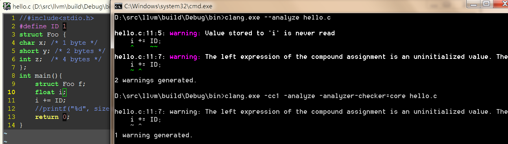
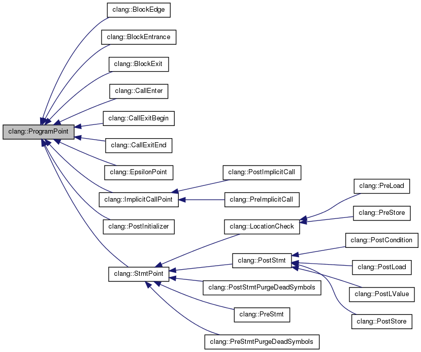

#有关LLVM

##一、编译与安装
###1、Linux下源码编译

	$ git clone [http://llvm.org/git/llvm.git](http://llvm.org/git/llvm.git)
	$ cd llvm/tools
	$ git clone [http://llvm.org/git/clang.git](http://llvm.org/git/clang.git)
	$ cd clang/tools
	$ git clone [http://llvm.org/git/clang-tools-extra.git](http://llvm.org/git/clang-tools-extra.git) extra
	$ cd ../../llvm/projects
	$ git clone [http://llvm.org/git/compiler-rt.git](http://llvm.org/git/compiler-rt.git)
	$ git clone [http://llvm.org/git/llvm-project/test-suite.git](http://llvm.org/git/llvm-project/test-suite.git)   #测试套，可选
	$ cd ../llvm/tools
	$ git clone http://llvm.org/git/llvm-project/lldb.git #低级别调试器，可选
	$ mkdir where-you-want-to-install	#安装目录
	$ mkdir where-you-want-to-build		#编译目录
	$ cd where-you-want-to-build
	$ /PATH_TO_SOURCE/configure --disable-optimized --prefix=../where-youwant-to-install  #--enable-optimized(off),--enable-assertions(on),--enable-shared(off),--enable-jit(on),--enable-targets(all)
	$ make && make install				#开始编译
	$ echo $?    #返回0.表明编译成功
	$ export PATH="$PATH:where-you-want-to-install/bin"		#加到PATH环境变量中
	$ clang –v

###2、Windows下源码编译
	下载源码，同上
	下载[cmake-3.3.1-win32-x86.exe](http://www.cmake.org/files/v3.3/cmake-3.3.1-win32-x86.exe)，安装cmake
	打开cmake GUI， ADD Entry。 CMAKE_INSTALL_PREFIX等同于--prefix；LLVM_TARGETS_TO_BUILD("ARM;Mips;X86")等同于--enable-targets

###3、Mac OS X下源码编译
	比windows,cmake多一个变量LLVM_ENABLE_PIC

##二、Clang
	clang分三个实体概念：
		clang驱动：利用现有OS、编译环境以及参数选项来驱动整个编译过程的工具。
		clang编译器：利用clang前端组件及库打造的编译器，其入口为cc1_main; 参数为clang -cc1 或者 -Xclang；
        clang前端组件及库：包括Support、Basic、Diagnostics、Preprocessor、Lexer、Sema、CodeGen等；

###1、clang前端组件及库，参考["Clang" CFE Internals Manual](http://clang.llvm.org/docs/InternalsManual.html#basic-blocks)

- **LLVM Support Library**

		提供基本的库和数据结构，包括命令行选项处理、各种容器、系统抽象层和文件系统操作

- **The Clang “Basic” Library**
	
		这个“基本”库包含了跟踪和操作代码缓存，源码缓存区中的定位，诊断，序列，目标抽取，和被编译的编程语言的子集的相关信息这
        一系列的底层公共操作。这个库的一部分是特别针对C语言的（比如TargetInfo类），剩下的部分可以被其他的不是基于C的编程语
		言重用（SourceLocation, SourceManager, Diagnostics, FileManager）。

- **诊断字系统（Diagnostics）**

		DiagnosticParseKinds.td

	- **Diagnostic、DiagnosticConsumer类**
		- SourceLocation、SourceManager类
		- SourceManager类用于加载和缓存源代码
- **The Driver Library**
- **Precompiled Headers**
- **The Frontend Library**
- **The Lexer and Preprocessor Library**
	
	- token分为：
		- 1、正常token 
		- 2、注解token
	- Preprocessor类
		- 成员变量
			- LexingRawMode： 原始模式，输出空格、注释等token 
	- Token类
	- TokenLexer类
	- Lexer类
	- MultipleIncludeOpt类
	- The Parser Library
		- parser类
	- The AST Library
		- Type类及其子类
		- ASTContext类
		- QualType类
		- DeclarationName类
		- DeclContext类
		- CFG类
		
					源码级控制流图，专用于语句(Stmt\*),通常用于函数体CompoundStmt，通过查找“: public Stmt”可以找到所有
					的子类语句

			- 基本块 
			
					是一个只能从它的第一条指令进入，并从最后一条指令离开的最长的指令序列。
					基本块第一条指令（首领leader）：1、程序的入口点 2、分支的目标 3、分支下条指令

				- CFGBlock
			- 入口(entry)和出口节点(exit)
				- null
			- 条件控制流
				- null   
- **The Sema Library**

		该库被Parser库调用用于作语义分析，输出AST

- **The CodeGen Library**

		输入AST输出LLVM IR

- **libclang库**

`libclang库是什么？`libclang提供了一系列的C语言的接口，可是这些接口并不能全然提供存储在Clang C++ AST中的全部信息，仅仅能提供部分基本信息，可是这些基本信息已经能够满足普通情况下的使用。主要目的是为了稳定，而且能够支持开发工具的基本功能。
	
	  	
`依赖库`

	clangAST
	clangBasic
	clangFrontend
	clangIndex
	clangLex
	clangSema
	clangTooling

`主要接口(BuildSystem.h、CXString.h、Index.h、CXCompilationDatabase.h、Documentation.h)`
	

- **libtooling库**

`依赖库`

	clangAST
	clangASTMatchers
	clangBasic
	clangDriver
	clangFrontend
	clangLex
	clangRewrite
	clangToolingCore

###clang编译器
####编译器选项（clang -cc1 -help，CC1Options.td中定义）	
   选项     | 说明 | FrontendAction子类 | ASTConsumer子类 | 备注
------------- | ------------- | ------------- | ------------- | -------------
-init-only | | InitOnlyAction | | 只做前端初始化
-Eonly | 预处理 | PreprocessOnlyAction | | 只做预处理，不输出
-E | 预处理 | PrintPreprocessedAction | | 子选项还包括-P、-C、-dM、-dD具体查看PreprocessorOutputOptions类
 | 预处理 | RewriteIncludesAction | | 
-dump-tokens | 打印token | DumpTokensAction |  | 输出tokens
-dump-raw-tokens | 打印tokens | DumpRawTokensAction |  | 输出原始tokens，包括空格符
-rewrite-test | 测试宏定义处理 | RewriteTestAction |  | 类似-rewrite-macros，仅测试用
-rewrite-macros | 处理并扩展宏定义 | RewriteMacrosAction |  | 
-emit-html | 生成高亮的代码网页 | HTMLPrintAction | HTMLPrinter | 
-print-decl-contexts | 打印声明 | DeclContextPrintAction | DeclContextPrinter | 
-ast-list | 打印ast节点 | ASTDeclListAction | ASTDeclNodeLister | clang -S -D_WIN32 -Xclang **-ast-list** hello.c
-ast-dump | 打印ast详细信息 | ASTDumpAction | ASTPrinter | 
-ast-view | 生成ast dot | ASTViewAction | ASTViewer | 
-analyze | 运行静态分析引擎 | AnalysisAction | AnalysisConsumer | clang -cc1 -analyzer-checker-help显示所有checkers；，具体请看《clang静态分析器》
-emit-llvm | 生成.ll IR汇编文件 | EmitLLVMAction | BackendConsumer | clang -S -D_WIN32 -Xclang **-emit-llvm** hello.c -o hello.ll
-emit-llvm-bc | 生成.bc IR二进制文件 | EmitBCAction | BackendConsumer | clang -S -D_WIN32 -Xclang **-emit-llvm-bc** hello.c -o hello.bc
-migrate | 代码迁移 | MigrateSourceAction | ObjCMigrateASTConsumer | 

*备注：*

1. FrontendAction及其子类主要是前端功能的集合，不同的子类包含的功能不同；
2. ASTConsumer及其子类主要是后端功能的集合，不同的子类包含的功能不同；
3. 编译器选项表格中基本上按功能从小到大排列；

####clang流程分析
- 入口cc1_main

	- 创建编译器对象Clang（CompilerInstance类）
	- CompilerInvocation::CreateFromArgs↓
		- 从clang/Driver/Options.inc读取选项，构建选项表
		- **ParseAnalyzerArgs解析出静态分析器选项**，解析出静态分析analyze有关的参数与子选项，例如-analyzer-checker、-analyzer-checker-help
		- **ParseMigratorArgs解析出**，
		- **ParseDependencyOutputArgs解析出**，
		- **ParseCommentArgs解析出**，
		- **ParseFileSystemArgs解析出**，
		- **ParseFrontendArgs解析出前端选项**，例如选项-analyze，对应frontend::RunAnalysis；-plugin，对应frontend::PluginActionfrontend::PluginAction；
		- **ParseTargetArgs解析出**，
		- **ParseCodeGenArgs解析出**，
		- **ParseHeaderSearchArgs解析出**，
		- **parseSanitizerKinds解析出**，
		- **ParseLangArgs解析出**，
		- **ParsePreprocessorArgs解析出**，
		- **ParsePreprocessorOutputArgs解析出**，

	- 创建诊断引擎对象（DiagnosticsEngine类）， CompilerInstance::createDiagnostics 
	- ExecuteCompilerInvocation↓
		- **创建FrontendAction子类对象，CreateFrontendAction工厂模式**
			- 调用CreateFrontendBaseAction，根据FrontendAction相关类型，创建FrontendAction子类对象
				- 如果frontend::RunAnalysis，创建AnalysisAction类对象
				- 其他类型创建其他FrontendAction子类对象
				- 如果选项为frontend::PluginAction（选项-plugin），创建PluginASTAction类对象
		- CompilerInstance::ExecuteAction，传入ACT（AnalysisAction类）
			> Act.BeginSourceFile（FrontendAction::BeginSourceFile），创建具体的Consumer并插入到Consumers
				- createPreprocessor::createPreprocessor创建PTH管理对象(PTHManager)、头文件搜索对象(HeaderSearch)等来构建预处理对象(Preprocessor)
					- InitializePreprocessor中会预设一些内置宏，例如<built-in>、#__include_macros、__llvm__、__clang_major__等
	
			- **CreateWrappedASTConsumer，集中创建Consumer子类对象**
				- **调用FrontendAction子类对象的CreateASTConsumer函数，创建Consumer子类对象，因此每个FrontendAction子类必须重写该函数**
				- 如果有clang插件(-plugin)，遍历调用所有Consumer子类对象CreateASTConsumer函数，最后创建MultiplexConsumer，封装所有的Consumer子类对象
	
	
			> **Act.Execute(FrontendAction::Execute()），该函数会调用FrontendAction::ExecuteAction(纯虚函数，每个子类必须实现该函数)**
	
			`-E选项流程↓只做预处理部分`
	
			- PrintPreprocessedAction::ExecuteAction()
				- clang::DoPrintPreprocessedInput,传入预编译对象、输出流、预编译选项对象（只需要这三样即可） 
	
			`-dump-tokens选项流程↓词法分析`
		
			- DumpTokensAction::ExecuteAction
				- Preprocessor::EnterMainSourceFile预处理的准备工作
					- SourceManager::getMainFileID为当前处理的第一个文件(主文件)产生一个MainFileID(FileID类)
					- Preprocessor::EnterSourceFile
					- 为built-in创建FileID对象
					- Preprocessor::EnterSourceFile
				- Preprocessor::Lex词法分析
				- Preprocessor::DumpToken输出tokens
	
			`-analyze选项流程↓需要抽象语法树AST作为后端输入，例如选项-analyze对应的AnalysisAction和-emit-llvm对应的EmitLLVMAction都直接继承ASTFrontendAction，并调用ParseAST`
	
			- ASTFrontendAction::ExecuteAction
	
				- 如果支持代码补全，则创建代码补全Consumer（PrintingCodeCompleteConsumer类）
				- 创建语义对象Sema，由Preprocessor、ASTConsumer、ASTContextCodeCompleteConsumer等对象传入构成
				- **ParseAST构建抽象语法树，从预处理->词法分析->语法分析->语义分析->AST**
					- Parser::Initialize
						- Sema::Initialize语义对象初始化
							- **Consumer.Initialize ASTConsumer子类的初始化函数**
							
								`-analyze选项流程↓静态分析器后端初始化`
	
								- **AnalysisConsumer::Initialize初始化**
									- 具体流程请看《clang静态分析器》部分
					
						- **Parser::ConsumeToken，预处理和词法分析并生成tokens**
							- Preprocessor::Lex，根据输入Lex类型（CLK_Lexer、PTHLexer、CLK_TokenLexer、CLK_CachingLexer、CLK_LexAfterModuleImport）分别进一步处理↓
								- CLK_Lexer：
	
					- **Parser::ParseTopLevelDecl，从上(顶级声明)自下结合tokens(Parser::ConsumeToken已分析出所有tokens)，开始语法分析、语义分析，最终生成ASTNode；创建函数在Stmt.cpp和Decl.cpp中**
						- ParseExternalDeclaration
						    - Parser::ParseDeclaration
						    	- 获取token类型
							    	- case 模板、导出：
							    		- ParseDeclarationStartingWithTemplate
							    	- case 内联：
							    		- ParseSimpleDeclaration
							    	- case 名字空间：
							    		- ParseNamespace
							    	- case using：
							    		- ParseUsingDirectiveOrDeclaration
							    	- case assert：
							    		- ParseStaticAssertDeclaration
									- case 其他：
							    		- ParseSimpleDeclaration
								- ConvertDeclToDeclGroup			    		
						    		
							- case 未知： ParseDeclarationOrFunctionDefinition
								- ParseDeclOrFunctionDefInternal
									- ParseDeclGroup			
										- ActOnDeclarator
											- HandleDeclarator
												- or ActOnTypedefDeclarator
												- or ActOnFunctionDeclarator
												- or ActOnVariableDeclarator
										- 函数定义ParseFunctionDefinition
											- ParseFunctionDefinition
												- ParseCompoundStatementBody
													- ParseStatementOrDeclaration
														- ParseStatementOrDeclarationAfterAttributes
															- case if语句
																- ParseIfStatement
															- case 其他语句
																- Pasese_XX_Statement				
	
				- **ASTConsumer子类::HandleTranslationUnit，每个ASTConsumer子类需要重写**
					- 如果是组合ASTConsumer，调用MultiplexConsumer::HandleTranslationUnit，然后遍历调用每个子类HandleTranslationUnit；
					
					`-analyze选项流程↓静态分析器后端处理流程`
	
					- 如果是静态分析器，调用AnalysisConsumer::HandleTranslationUnit，具体流程请看《clang静态分析器》部分；
					
					`流程之一↓其他流程`
					- ... ...
			 
	
			> Act.EndSourceFile（FrontendAction::EndSourceFile）
	
			- 如果DisableFree为1，保留Sema、ASTContext、ASTConsumer
			- 否则，重置Sema、ASTContext、ASTConsumer为nullptr
		
		- 诊断输出结果

*备注：*

1. 通过clang编译器选项，来选择创建不同的FrontendAction，具体在createFrontendBaseAction函数中，创建不同的FrontendAction对象
2. FrontendAction::CreateASTConsumer用于创建不同ASTConsumer对象，因此需实现该函数；
3. FrontendAction::ExecuteAction用于衔接后端，例如ASTFrontendAction::ExecuteAction调用ParseAST解析语法树并传递给后端，而DumpRawTokensAction只打印tokens；
4. 需要抽象语法树的后端，需要调用ParseAST函数；

####架构图

####预处理Preprocessor与词法分析Lexer
#####常见的预处理有：文件包含，条件编译、布局控制和宏替换4种：

1. 文件包含，例如：#include
2. 条件编译，例如：#if,#ifndef,#ifdef,#endif,#undef等
3. 布局控制，例如：#progma
4. 宏替换，例如：#define

*clang除上面标准预处理(CLK_Lexer)外，还支持自身扩展的预处理CLK_PTHLexer、CLK_TokenLexer、CLK_CachingLexer、CLK_LexAfterModuleImport*

#####TokenKinds.def，关键字定义	 

#####Preprocessor类

	成员变量:
		DiagnosticsEngine诊断引擎
		LangOptions编译选项
		TargetInfo存储目标信息
		FileManager文件管理器
		SourceManager源码管理器
		ModuleLoader module加载器
	成员函数:
		Preprocessor::Lex

#####处理流程

- Preprocessor::Lex识别到一个token才返回，具体根据CurLexerKind调用不同的Lexer子类对象及函数去处理
	-  标准预处理CLK_Lexer，Lexer::Lex C/C++标准
		- Lexer::LexTokenInternal按字符流逐个处理
			-  如果是文件结尾，调用LexEndOfFile
				- Preprocessor::RemoveTopOfLexerStack
					- Preprocessor::PopIncludeMacroStack，通过Pop操作，还原原来的CurLexerKind的值  
			-  如果是预处理标识符，调用Preprocessor::HandleDirective
				- Preprocessor::HandleDirective由预处理对象处理
					- 如果标识符是‘#define’，HandleDefineDirective
						- 如果创建了Callbacks,并重载了Ident函数（例如-E -dD,PrintPPOutputPPCallbacks::Ident），则输出Ident值
					- 如果Ident是'#include',HandleIncludeDirective
						- EnterSourceFile包含新文件，根据文件类型创建不同的Lexer
							- 如果是普通的.文件，EnterSourceFileWithLexer
								- 调用PushIncludeMacroStack，把原有的CurLexerKind压栈push，并设置当前的Lexer类型CurLexerKind
 
			-  如果是标识符，调用Preprocessor::HandleIdentifier
				- 如果该标识符是可扩展的，调用HandleMacroExpandedIdentifier继续处理
					- 内置宏？
					- 其他？ 

	-  CLK_PTHLexer针对PTH文件
	-  CLK_TokenLexer
	-  CLK_CachingLexer
	-  CLK_LexAfterModuleImport针对import

####clang插件
- 具体参考“PrintFunctionNames”例子
	clang -cc1 -load printFunctionNames.dll -plugin print-fns a.c    	 #替换默认的FrontendAction
	clang -cc1 -load printFunctionNames.dll -add-plugin print-fns a.c    #添加FrontendAction

####clang静态分析器
#####按功能区分的选项（clang -cc1 -analyzer-checker-help，Checkers.td中定义）

   选项     | 说明 | 备注
-analyzer-checker=debug | |

1. Clang Static Analyzer就是利用不同的checker来检测源码不同类型的bug的。
	
2. 静态分析器会默认使用6类checkers(default checker)：

	- Core Checkers：提供一些一般性的检查，比如是否被0除、是否使用空指针和使用未初始化参数等。
	- C++ Checkers：提供C++检查。
	- Dead Code Checkers：检查没有使用的代码。
	- OS X Checkers：检查Objective-C和Apple's SDKs的使用情况。
	- Security Checkers:检查不安全API的使用和基于CERT Secure Coding Standards的检查。
	- Unix Checkers：检查Unix和POSIX API的使用情况。

3. 
	- ExplodedGraph
		- ExplodedNode
			- ProgramPoint
			- ProgramState
				- Environment 
				- Store
				- GenericDataMap 

4. 主要流程
	- cc1_main
	    - ...
		- CreateWrappedASTConsumer
			- **AnalysisAction::CreateASTConsumer**
				- **创建AnalysisASTConsumer对象** 	
		- ...
		- clang::ParseAST
			- Parser::Initialize
				- Sema::Initialize
					- **AnalysisConsumer::Initialize初始化**
						- ento::createCheckerManager 
							1. 创建CheckerManager 
							2. 创建allcheckers对象(ClangCheckerRegistry类)
							    - registerBuiltinCheckers，调用addChecker函数添加Checkers.inc中所有的信息，例如：checker的注册函数、名字、描述生成CheckerInfo结构，放入vector中**（参考如何编写Checker，方式一）**
							    - 如果有共享库方式存在的checker(选项-load 共享库路径)，则使用DynamicLibrary类，加载共享库，找到clang_registerCheckers和clang_analyzerAPIVersionString符号，并调用clang_registerCheckers函数**（参考如何编写Checker，方式二）**
							3. CheckerRegistry::initializeManager
								- 根据选项再次选择checker
								- 遍历调用checker的注册函数
									- register##name，每个checker必须定义注册函数**（参考如何编写Checker，方式一）**
			- **AnalysisConsumer::HandleTranslationUnit,静态分析器分析入口**
				- AnalysisConsumer::HandleDeclsCallGraph
					- AnalysisConsumer::HandleCode
						- AnalysisConsumer::RunPathSensitiveChecks
							- AnalysisConsumer::ActionExprEngine
								- ExprEngine::ExecuteWorkList
									- CoreEngine::ExecuteWorkList
										- CoreEngine::dispatchWorkItem,根据程序点类型进一步处理 
							
						

5. ExplodedGraph CFG路径

8. CheckerManager

9. CheckerContext上下文
	- addTransition方法，改变状态
	- generateSink

10. ProgramPoint程序关键点（等同checker类成员函数、回调函数）

	- [check::PreStmt<xxx>] - 在statement xxx发生之前调用这个checker
	- [check::PostStmt<xxx>] - 在statement xxx发生之后调用这个checker
	- [check::PreCall] - 在函数调用之前调用这个checker
	- [check::EndFunction] - 在函数结束时调用这个checker
	- [check::BranchCondition] - 在分支出现时调用这个checker
	- [check::DeadSymbols] - 当参数超出生命周期时调用这个checker
	- **checker的回调函数要么修改程序状态，要么报告bug。**

7. ProgramState表示程序所在状态
	- Clang Static Analyzer就像其他静态分析工具一样，并不会执行源代码，而是象征性的执行代码(symbolic excution)，并且会执行代码中的每一个分支(Path Sensitive)。
	- 在“执行”过程中，Analyzer会实时的根据运行情况追踪和改变程序状态(Program State)。
	- 注册状态宏：REGISTER_TRAIT_WITH_PROGRAMSTATE、REGISTER_MAP_WITH_PROGRAMSTATE、REGISTER_SET_WITH_PROGRAMSTATE、REGISTER_LIST_WITH_PROGRAMSTATE
	- CheckerContext类包含了一些操作状态的函数，例如获取状态getState()，更改状态addTransition(State)、产生sink节点generateSink()，上报BUG EmitReport(BUG)
	- 节点类ExplodedNode、BUG类BugReport、状态类ProgramState

#####如何编写Checker
	两种编写Checker方式：一、一种直接编译进clang编译器中；二、生成共享库,由clang编译器动态加载

######方式一
- 在lib/StaticAnalyzer/Checkers目录下，创建xxxxChecker.cpp
- xxxxChecker.cpp编写Checke子类和注册函数：
		using namespace clang;
	    using namespace ento;
	
	    namespace {
	    	class NewChecker: public Checker< check::PreStmt<CallExpr> > {
	    		public:
	      			void checkPreStmt(const CallExpr *CE, CheckerContext &Ctx) const {}
	    		}
	    }
						
		void ento::registerxxxx(CheckerManager &mgr) {
  				mgr.registerChecker<xxxx>();
		}
- clang/lib/StaticAnalyzer/Checkers/Checkers.td注册Checker归属关系，例如alpha.core.yyyy
		
		let ParentPackage = CoreAlpha in {
		...
		def xxxxChecker : Checker<"yyyy">,    //注意yyyy，任意名字
		  HelpText<"Checker功能表述">,
		  DescFile<"xxxxChecker.cpp">;
		...
		} // end "alpha.core"

######方式二
- 具体参考“SampleAnalyzerPlugin”例子

####PASS遍
	在LLVM中，优化器被组织成优化pass的管道，常见的pass有内联化、表达式重组、循环不变量移动等。每个pass都作为继承Pass类的C++类，并定义在一个私有的匿名namespace中，同时提供一个让外界获得到pass的函数。
	PassInfo类的每一个对象都对应着一个实际存在的Pass，并且保存着这个Pass的信息。
	RegisterPass这个类是一个模板类，这个模板类的类型就是Pass的名字。它是PassInfo的子类，主要用来注册Pass。完成注册之后，在PassManager管理的内部数据库里才能找到这个Pass。需要注意的是，这个模板类的使用必须是在全局范围之内的。可以从最简单的Pass例子--Hello（http://llvm.org/docs/doxygen/html/Hello_8cpp_source.html）中去看这个模板类的使用方法。
	RegisterAGBase是RegisterAnalysisGroup类的基类，而RegisterAGBase类又是PassInfo类的子类。其中RegisterAGBase类名字中的AG就是AnalysisGroup的缩写，这种命名方式在LLVM的源码中被大量的应用，比如MetaData在一些类的名字里就被缩写为MD。RegisterAnalysisGroup这个类的作用主要是将一个Pass注册成为一个分析组的成员，当然在进行此操作之前，这个Pass必须被首先注册Pass成功。一个Pass可以被注册到多个分析组中。同一个Pass在多个分析组中，依然是根据这个Pass的名字进行标识的。
	PassRegistrationListener这个类主要负责在运行时时候Pass的注册与否，并且会在Pass被load和remove的时候，去调用回调函数。
#####内置pass
	CodegenAction::Execuetion
		clang::ParseAST
	BackendConsumer::HandleTranslationUnit
		clang::EmitBackendOutput
			EmitAssemblyHelper::EmitAssembly,根据参数选项添加不同的pass
				case Backend_EmitNothing： 不创建，对应-emit-llvm-only
				case Backend_EmitBC： 创建WriteBitcodePass，对应选项-emit-llvm-bc
				case Backend_EmitLL:  创建PrintModulePassWrapper，对应-emit-llvm
				case 其他：			创建TargetLibraryInfoWrapperPass，FunctionPass，对应-emit-obj、-emit-codegen-only

#####pass相关类
	PassManagerBuilderWrapper
	The ImmutablePass class
	The ModulePass class
	The CallGraphSCCPass class
	The FunctionPass class
	The LoopPass class
	The RegionPass class
	The BasicBlockPass class
	The MachineFunctionPass class

#####编写一个pass

###3、clang驱动
####31、 驱动选项（clang -help，Options.td定义）
- -cc1，clang编译器

- -###，打印clang driver Parse阶段命令行参数，参考：[Driver Design & Internals](http://clang.llvm.org/docs/DriverInternals.html)

- -ccc-print-phases，打印clang driver Pipeline阶段信息

- -ccc-print-bindings，打印clang driver Bind阶段各工具链及输入输出文件

- -Ｅ，预处理

- -Ｓ，预处理～汇编

- -c，预处理～生成obj

- -fcolor-diagnostics，诊断色彩

- -driver-mode=cl，等同于clang-cl，兼容VC

- emit-llvm，生成.ll中间语言文件

- -fsanitize=address

- -Wpadded

- -fpack-struct=1 or n，压缩

- -Wunused-variable，未初始化

####32、架构图
####33、流程分析
	1、解析参数选项
	2.1、如果有-cc1，走clang编译器流程
	2.2、创建Driver对象，传入Triple（编译clang时已指定）
	3、llvm初始化平台
	4、获取环境变量，如CC_PRINT_OPTIONS
	5、Driver.BuildCompilation，返回编译器对象
		⑴ 根据Triple，创建工具链对象，例如toolchains::Windows★
		⑵ 创建编译器对象C（Compilation）
		Driver.BuildActions构建JobAction
			⑶ getFinalPhase，根据参数选项，获取编译最终阶段FinaPhases
			⑷ getCompilationPhases，分析所需的阶段放入PL中
			for_each遍历PL
				⑸ ConstructPhaseAction，根据不同阶段创建不同的JobAction并放入Actions,例如预处理阶段，创建PreprocessJobAction; phases::Link不在这里处理
				
			⑹ 如果LinkerInputs不为空，按需创建LinkJobAction放入Actions
		Driver.BuildJobs构建任务
			⑺ BuildJobsForAction
				BuildJobsForAction
					TC->SelectTool
					√ clang::Constructjob，创建clang编译器的大量参数选项★
					√ visualstudio::Link::Constructjob，Link的参数选项★
			
	6、Driver.ExecuteCompilation，编译器对象执行任务
		Compilation::ExecuteJob
			ExecuteCommand★
				创建子进程执行命令，例如clang -cc1 xxxx; link.exe xxxx★
	7、Driver.generateCompilationDiagnostics,产生诊断信息
	8、llvm::llvm_shutdown()

      
									
##工具与例子
###extras工具
####PPTrace: C++预编译跟踪 

	- Clang Check：语法检查，输出AST
	- Clang Format: 代码格式化
	- Clang Modernizer: C++11风格
	- Clang Tidy: Google代码风格检查
	- Modularize: 模块化

###opt和bugpoint工具

###examples例子
	- BrainF
	- ExceptionDemo
	- Fibonacci
	- HowToUseJIT
	- ModuleMaker
	- Kaleidoscope，展示了如何在LLVM之上构建一个支持一门自己定义的编程语言的编译器
	- OCaml-Kaleidoscope
	- ParallelJIT

##llvm编程手册，参考["LLVM Programmer’s Manual](http://llvm.org/docs/ProgrammersManual.html)

##引用
[C11标准中文翻译](http://www.clang.pub/wiki/C11)